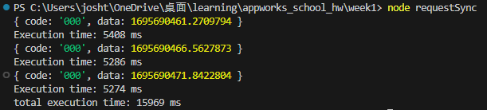
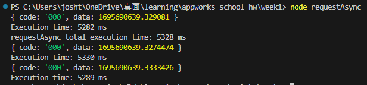
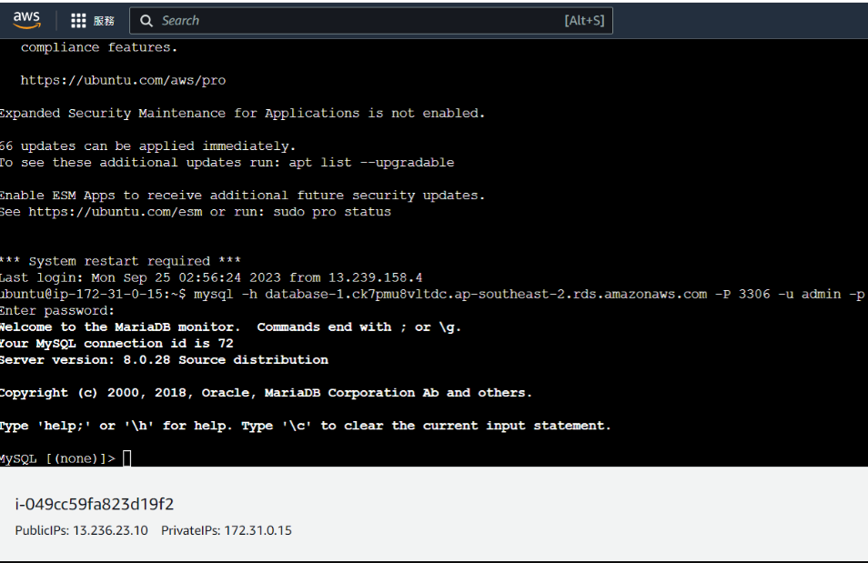

# Remote Homework Week 1

## Description

第一周作業

### Screenshots

- reqestSync


- requestAsync



### Questions

- Based on the result of experiment, what's the differences of sync/async functions we can tell?

  - sync 的 function 會等一個做完才做另一個，因此每次請求都會等到上一個請求結束之後才開始。

- In which types of situations are asynchronous functions most useful?

  - 在多次請求的資料互不關聯，且先後順序不影響時，使用 asynchronous functions 可以同時進行多個 function，降低所需的時間。

- We've known the 3 ways to implement async functions, how do we choose from them and what are their pros and cons?

  - callback
    pros: 在舊版的 js 環境中可以用，簡單的非同步操作用 callback 是較為簡潔的方式。
    cons: 錯誤處理較為複雜，code 可讀性較低，有可能會出現 callback hell。
  - promise
    pros: 以 chain 的方式串起來，code 可讀性較高，錯誤處理可以直接用 catch 來捕捉錯誤，且可以在任何函數中使用。
    cons: 在多個非同步操作時可能會產生很長一串的 promise，可讀性會降低。
  - async/await
    pros: 可讀性更高也很易用，錯誤可以直接用 try/catch 抓。
    cons: 只能用在 async 函數中使用。
  - 結論:
    一般可以直接選用 async/await 或是 promise，如果在較簡單的場景可以用 callback。

- Any other observations
  - 我發現 node 不支援原生的同步請求，一般要在 node 中使用同步請求可以用第三方的 library，例如 node-fetch，或是用非同步的方式來實現。

---

1. How do you make sure that you can connect into your RDS? And please post the successfully connected screen shot.

   - 用 ec2 連線至 rds 來確認。

     

2. Without Elastic IP, if we stop the EC2 instance and start it again, would the IP address change? Why?
   - ip 會變動，如果不為 ec2 設定彈性 ip，則 ec2 會得到的為動態 ip，每次重新開啟 instance 時的 ip 會改變。
3. What's the purpose of using Elastic IP?
   - 申請彈性 ip 後會更有穩定性，用戶不需擔心網站的 ip 改變，在申請 SSL 證書上也會比較簡單，只需要把證書與該 ip 建立關連就行。

### Others

- Third-party libraries used

  - node-fetch

    由於 nodejs 沒有內建同步請求的函式，這個 library 可以讓我們在 nodejs 中使用同步請求。

## Environment requirements

Nodejs >= 18.0.0 (for fetch)

npm

## How to use

1. clone 這個專案到本地端
2. 執行下方的指令下載所需的套件

```
$ npm install
```

3. 執行下方的指令執行程式

```
$ node requestAsync.js
$ node requestSync.js
```
